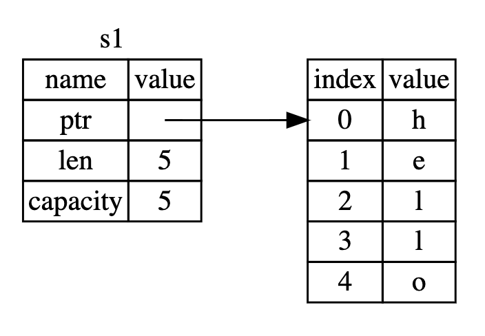

# Chapter 4: Understanding Ownership
Ownership in Rust is mos unique feature, and it enables Rust to make memory safety guarantees without needing a garbage collector. Therefore, it is important to understand how ownership works in Rust. In this chapter, we will talk about ownership as well as several related features: borrowing, slices, and how Rust lays data out in memory.

## Index
1. What is Ownership?
2. References and Borrowing
3. The Slice Type

## 1. What is Ownership?
Rust's central feature is _ownership_. Although the feature is straightforward to explain, it has deep implications for the rest of the language.

All programs have to manages the way they use a computer's memory while running.

Some languages have _garbage collection_ that constantly looks for no longer used memory as the program runs. In other languages, the programmer must explicitly allocate and free the memory.

Rust uses a third approach, memory is managed through a system of ownership with a set of rules that the compiler checks at compile time. None of the ownership feature slow down your program while it is running.

Because ownership is a new concept for many programmers, it does take some time to get used to. The good news is that mor experienced you become with rust and the rules of the ownership system, the more you will be able to naturally develop code that is safe and efficient. Keep at it!.

When you understand ownership, you will have a solid foundation for understanding the feature the make Rust unique. So, we will review some examples for understanding the concept with very common data structures, but before, we should recap the stack and the heap concepts.

### The Stack and the Heap
In many programming language you don't have to think about the stack and the heap very often. However, in systems programming language like Rust, whether a values is on the stack or the heap has more of an effect on how the language behaves ans why you have to make certain decisions.

Both, are parts of memory that are available to your code to use at runtime, but they are structured in different ways:

The stack store values in order it gets them and removes the values in the opposite order. This is referred as LIFO (Last In, First Out). Thick of a stack of plates, when you add more plates, you put them on top of the pile, and when you need a plate, you take one off the top. Adding or removing plates from the middle or bottom would not work as well. Adding data is called _pushing onto the stack_, and removing data is called _popping off the stack_. **All data on the stack must have a know, fixed size**.

Data with an unknown size at compile time or size that might change must be stored on the heap instead. The heap is less organized. When you put data on the heap, you request a certain amount of space. The operating system finds an empty spot in the heap that is big enough, ,arks it as being in use, and returns a __pointer_, which is the address of that location. This process is called **allocating on the heap**. Pushing values onto the stack is not considered allocating. Because the pointer is a know, fixed size, you can store the pointer on the stack, but when you want the actual data, you must follow the pointer.

Think of being seated  at a restaurant. When you enter, you state the number of people inn your group, and the staff finds an empty table that fits everyone and leads you there. If someone in your group comes late, the can ask where you have been seated to find you.

Pushing to the stack is faster than allocating on the heap because the operating system never has to search for a place to store new data. That location is always at the top of the stack. Comparatively, allocating space on the heap requires more work, because the operating system must first find a big enough space to hold the data and then perform bookkeeping to prepare the next allocation.

Accessing data in the heap is slower that accessing data in the stack because you have to follow a pointer to get there. Contemporary processors are faster if they jump around less in memory.

Continuing with the analogy, consider a server at a restaurant taking order from many tables. It is most efficient to get all the others at one tables before moving on the next table. By the same token, a processor can do its job better if it works on data that is close to other data (i.e. the stack), than farther away (i.e. the heap). Allocating a large amount of space on the heap can also take time.

When your code calls a function, the values passed into the function – probably including pointers to data on the heap –, and function's local variables get pushed onto the stack. When the function it is over, those values get popped off the stack.

Keeping track of what parts of code are using what data on the heap, minimizing the amount of duplicate data on the heap, and cleaning up unused data on the heap so you do not run out space are all problems that ownership addresses. Once you understand ownership, you won't need to think about the stack and the heap very often, but knowing that managing heap data is why ownership exists can help explain why it works the way it does.

### Ownership Rules
The ownership rules are three:

+ Each value in Rust has a variable that is called its _owner_.
+ There can only be one owner at a time.
+ When the owner goes out of the scope, the value will be dropped.

Please keep in mind these rules when we work through the example to illustrate them.

### Variable Scope
As a first example of ownership, we will look at the _scope_ of some variables. A scope is the range within a program for which an item is valid. Let's say we have a variable that looks like this:

```rust
#![allow(unused_variables)]
fn main() {
  let s = "hello";
}
```

The variable `s` refers to a string literal, where the value of the string is hardcoded into the text of out program. The variable is valid from the point at which it is declared until the end of the current scope. Below a snippet with the comments where `s` is valid.

```rust
#![allow(unused_variables)]
fn main() {
  {                      // s is not valid here, it’s not yet declared
      let s = "hello";   // s is valid from this point forward

    // do stuff with s
  }                      // this scope is now over, and s is no longer valid
}

```

In other words, there are two important points here:

+ When `s` comes into scope, it is valid
+ It remains valid until it goes out of scope

At this point, the relationship between scopes and when variable are valid is similar to that in other programming languages. Now we will build on top of this understanding by introducing the `String` type.

### The String Type
To illustrate the rules of ownership, we need a data type that is more complex than the ones we covered in the Data Types section of chapter 3. The types covered previously are all stored on the stack and pooped off the stack when their scope is over, but we want to look at data that is sotred on the heap and explore how Rust knows when to clean up that data.

We will use `String` as the example here and concentrate on the parts of `String` that relate to ownership. these aspects also apply to other complex data types, whether they are provided by the standard library or created by you.

We have already seen string literals, where a string value is hardcoded into our program. Sting literals are convenient, but they are not suitable for every situation in which we may want to use text. One reason is that they are immutable. Another is that not every string value can be known when we write our code. For example, what if we want to take user input and store it? For these situation, Rust has second a second string type, `String`. This type is allocated on the heap and as such is able to store an amount of text that is unknown to us at compile time. You can create a `String` from a string literal using the `from` function, like so.

```rust
#![allow(unused_variables)]
fn main() {
  let s = String::from("hello");
}
```

The double colon `::` is an operator that allows us to namespace this particular `from` function under the `String` type rather that using some sort of name like `string_from`. We will discuss this syntax in the _Method Syntax_ section of the next chapter and when we talk about namespacing with modules in _Paths for Referring to an item in the Module Tree_ in chapter 7.

This kind of string can be mutated.

```rust
#![allow(unused_variables)]
fn main() {
  let mut s = String::from("hello");

  s.push_str(", world!"); // push_str() appends a literal to a String

  println!("{}", s); // This will print `hello, world!`
}
```

So, why can `String` be mutated but literals cannot? The difference is how these two types deal with memory.

### Memory and Allocation
In the case of a string literal, we know the contents at compile time, so the text is hardcoded directly into the final executable. This is why string literals are fast and efficient. But, these properties only come from the string literal's immutability. Unfortunately, we cannot put a blob of memory into the binary for each piece of text whose size is unknown at compile time an whose size might change while running the program.

With the `String` type, in order to support a mutable, growable piece of text, we need to allocate an amount of memory on the heap, unknown at compile time, to hold the contents. This means.

+ The memory must be requested from the operating system at runtime.
+ We need a way of returning this memory to the operating system when we are done with our `String`.

That first part is done by us. When we call `String::from`, its implementation requests the memory it needs. This is pretty much universal in programming languages.

However, the second part it is different. In languages with garbage collector (GC), it keeps track and cleans up memory that is not being used anymore, and we do not need to thing about it. Without GC, it is our responsibility to identify when memory is no longer being used and call code to explicitly return it, just as we did to request it. Doing this correctly has historically been a difficult programming problem. If we forget, we will waste memory. If we do it too early, we will have an invalid variable. If we do it twice, that is a bug too. We need to pair exactly one `allocate` withy exactly one `free`.

Rust takes a different path. The memory is automatically returned once the variable that owns it goes out of scope. Here is a version of our scope example is usign a `String` instead of a string literal.

```rust

#![allow(unused_variables)]
fn main() {
{
    let s = String::from("hello"); // s is valid from this point forward

    // do stuff with s
}                                  // this scope is now over, and s is no
                                   // longer valid
}

```

There is a natural point at which we can return the memory our `String` needs to the operating system. When `s` goes out of the scope. When a variable goes out of scope, Rust calls a special function for us. This function is called `drop`, and it is where the author of `String` can put the code to return the memory. Rust calls `drop` automatically at the closing curly bracket.

> **Note:** In C++, this pattern of dellocating resources at the end of item's lifetime is sometimes called _Resource Acquisition Is Initialization (RAII)_. The `drop` function in rust will be familiar to you if you have used RAII patterns.

This pattern has a profound impact on the way Rust code is written. It may seem simple right now, but the behavior of code can be unexpected in more complicated situations when we want to have multiple variables use the data we have allocated on the heap. Let's explore some of those situations.

#### Ways Variables and Data Interact: Move
Multiple variables can interact with the same data in different ways in Rust. Let's look at an example using an integer.

```rust

#![allow(unused_variables)]
fn main() {
  let x = 5;
  let y = x;
}
```

We can probably guess what this is doing, bind the value `5` to `x`, then make a copy of the value in `x` and bind it to `y`. We now have two variables, `x` and `y`, and both equal to `5`. This is indeed what is happening, because integers are simple values with a know, fixed size, and these two `5` values are pushed onto the stack.

Now, let's look at the `String` version.

```rust

#![allow(unused_variables)]
fn main() {
  let s1 = String::from("hello");
  let s2 = s1;
}

```

This looks very similar to the previous code, so we might assume that the way it works would be the same. That is, the second line would make a copy of the value `s1` and bind it to `s2`. But this is not quite what happens.

Take a look to the next figure to see what is happening to `String` under the covers. A `String` is made up of three parts, show on the left, a pointer to the memory that holds the contents of the string, a length, and a capacity. This group of data is stored on the stack. On the right is the memory on the heap that holds the contents.



The length is how much memory, in bytes, the contents of the `String` is currently using. The capacity is the total amount of memory, in bytes, that the `String` has received from the operating system. The difference between length and capacity matters, but not in this context, so for now, it is fine to ignore the capacity.

When we assign `s1` to `s2`, the `String` data is copied, meaning we copy the pointer, the length, and the capacity that are on the stack. We do not copy the data on the heap that the pointer refers to. In other words, the data representation in memory looks like this.


The representation does not look like the next image, which is what memory would look like if Rust instead copied the heap data as well. If Rust did this, the operation `s1 = s2` could be very expensive in terms of runtime performance if the data on the heap were large.


Earlier, we said that when a variable goes out of scope, Rust automatically calls the `drop` function and cleans up the heap memory for that variable. But the first image of representation of memory shows both data pointers pointing to the same location. This is a problem, when `s1` and `s2` go out of scope, they will both try to free the same memory. This is known as _double free_ error and is one of the memory safety bugs we mentioned previously. Freeing memory twice can lead to memory corruption, which can potentially lead to security vulnerabilities.

To ensure memory safety, there is one more detail to what happens in this situation in Rust. Instead of trying to copy the allocated memory. Rust `s1` to no longer be valid and, therefore, Rust does not need to free anything when `s1` goes out of scope. Check out what happens when you try to use `s1` after `s2` is created. It won't work.

```rust
let s1 = String::from("hello");
let s2 = s1;

println!("{}, world!", s1);
```

You will get an error like this because Rust prevents you form using the invalidated reference.

```
error[E0382]: use of moved value: `s1`
 --> src/main.rs:5:28
  |
3 |     let s2 = s1;
  |         -- value moved here
4 |
5 |     println!("{}, world!", s1);
  |                            ^^ value used here after move
  |
  = note: move occurs because `s1` has type `std::string::String`, which does
  not implement the `Copy` trait

```

If you have heard the therms _shallow copy_ and _deep copy_ while working with other languages, the concept of copying the pointer, length and capacity without copying the data probably sound like making a shallow copy. But because Rust also invalidates the first variables, instead of being called a shallow copy, it is known as a _move_. In this example, we would say that `s1` was moved into `s2`. So what actually happens is showing next.


That solves our problem! with only `s2` valid, when it goes out of scope, it alone will free the memory and we are done.

In addition, there is a design choice that is implied by this. Rust will never automatically create _deep_ copies of your data. Therefore, any _automatic_ copying can be assumed to be inexpensive in terms of performance.

#### Ways Variables and Data Interact: Clone
If we do want to deeply copy the heap data of the `String`, not just the stack data, we can use a common method called `clone`. It is probably that you have seen this method in other programming languages. Below, an example of the `clone` method in action.

```rust

#![allow(unused_variables)]
fn main() {
  let s1 = String::from("hello");
  let s2 = s1.clone();

  println!("s1 = {}, s2 = {}", s1, s2);
}

```

This works just fine and explicitly produces the behavior shown in the last image, where the heap data does get copied.

 When you see a call to `clone`, you know that some arbitrary code is being executed and that code may be expensive. It is a visual indicator that something different is going up.

#### Stack-Only Data: Copy
There is another wrinkle we have not talked about yet. This code using integers, part of which shown before, works and is valid.

```rust

#![allow(unused_variables)]
fn main() {
  let x = 5;
  let y = x;

  println!("x = {}, y = {}", x, y);
}
```

But this code seems to contradict what we just learned. We do not have a call to `clone`, but `x` is still valid and was not moved into `y`.

The reason is that types such as integers that have a known size at compile time are stored entirely on the stack, so copies of the actual values are quick to make. That means there is no reason we would want to prevent `x` from being valid after we create the variable `y`. In other words, there is no difference between deep and shallow copying here, so calling `clone` would not do anything different from the usual shallow copying and we can leave out.

Rust has a special annotation called `Copy` trait that we can place on types like integers that are stored on the stack. If a type has the `Copy` trait, an older variable is still usable after assignment. Rust won't let us annotate a type with the `Copy` trait if the type, or any of its parts, has implemented the `Drop` trait. If the type needs something special to happen when the values goes out of scope and we add the `Copy` annotation to that type, we will get a compile-time error.

So what type are `Copy` You can check the documentation for the given type to be sure, but as a general rule, any group of simple scalar values van be `Copy`, and nothing that requires allocation or is some form of resource is `Copy`.

+ All the integers types, such as `u32`.
+ The Boolean type, `bool`, with values `true` and `false`.
+ All the floating point types, such as `f64`.
+ The character type, `char`.
+ Tuples, if they only contain types that are also `Copy`.

### Ownership and Functions
The semantics for passing value to a function are similar to those for assigning a value to a variable. Passing a variable to a function will move or copy, just as assignment does. The next snippet has an example with some annotations showing where variables got into and out of the scope.

```rust
fn main() {
    let s = String::from("hello");  // s comes into scope

    takes_ownership(s);             // s's value moves into the function...
                                    // ... and so is no longer valid here

    let x = 5;                      // x comes into scope

    makes_copy(x);                  // x would move into the function,
                                    // but i32 is Copy, so it’s okay to still
                                    // use x afterward

} // Here, x goes out of scope, then s. But because s's value was moved, nothing
  // special happens.

fn takes_ownership(some_string: String) { // some_string comes into scope
    println!("{}", some_string);
} // Here, some_string goes out of scope and `drop` is called. The backing
  // memory is freed.

fn makes_copy(some_integer: i32) { // some_integer comes into scope
    println!("{}", some_integer);
} // Here, some_integer goes out of scope. Nothing special happens.

```

If we tried to use `s` after the call to `takes_ownership`, Rust would throw a compile-time error.
These static check protect us from mistakes. Try adding code to `main` that uses `s` and `x` to see where you can use them and where the ownership rules prevent you from doing so.

### Returns Values and Scope
Returning values can also transfer ownership. The next code have similar annotations that we put in the functions ownership example.

```rust
fn main() {
    let s1 = gives_ownership();         // gives_ownership moves its return
                                        // value into s1

    let s2 = String::from("hello");     // s2 comes into scope

    let s3 = takes_and_gives_back(s2);  // s2 is moved into
                                        // takes_and_gives_back, which also
                                        // moves its return value into s3
} // Here, s3 goes out of scope and is dropped. s2 goes out of scope but was
  // moved, so nothing happens. s1 goes out of scope and is dropped.

fn gives_ownership() -> String {             // gives_ownership will move its
                                             // return value into the function
                                             // that calls it

    let some_string = String::from("hello"); // some_string comes into scope

    some_string                              // some_string is returned and
                                             // moves out to the calling
                                             // function
}

// takes_and_gives_back will take a String and return one
fn takes_and_gives_back(a_string: String) -> String { // a_string comes into
                                                      // scope

    a_string  // a_string is returned and moves out to the calling function
}
```
The ownership of a variable follows the same pattern every time. Assigning a value to another variable moves it. When a variable that includes data on the heap goes out of scope, the value will be cleaned up by `drop` unless the data has been moved to be owned by another variable.

Taking ownership and then returning ownership with every function is a bit tedious. What if we want to let a function use a value but not take ownership? It is quite annoying that anything we pass in also needs to be passed back if we want to use it again, in addition to any data resulting from the body of the function that we might want to return as well.

It is possible to return multiple values using a tuple, as shown below.

```rust
fn main() {
    let s1 = String::from("hello");

    let (s2, len) = calculate_length(s1);

    println!("The length of '{}' is {}.", s2, len);
}

fn calculate_length(s: String) -> (String, usize) {
    let length = s.len(); // len() returns the length of a String

    (s, length)
}

```

But this is too much ceremony and a lot of work for concept that should be common. Luckily for us, Rust has a feature for this concept, called _references_.

## 2. References and Borrowing

## 3. The Slice Type
